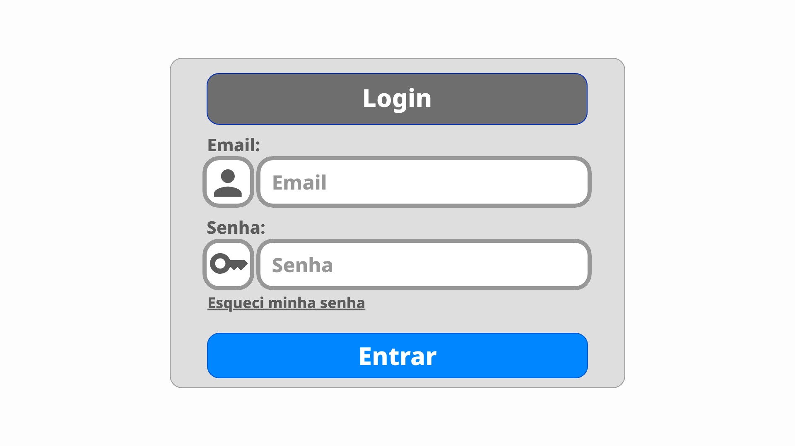

# ChameleCards

## Descrição do projeto
### Contexto
O **ChameleCards** é uma aplicação voltada para a revisão e acompanhamento de matérias através do método de cartões de memória (flashcards) e repetição espaçada. A plataforma atua como uma ferramenta centralizadora de estudos, auxiliando na organização do planeamento individual.

O aplicativo **não** se propõe a ser fonte primária de conteúdo, proporcionar aprendizado inicial, oferecer cursos completos ou servir como ferramenta de avaliação académica.

### O Problema
Muitos estudantes enfrentam dificuldades na retenção de conteúdos e na organização da sua rotina de estudos. A acumulação de matérias gera incerteza sobre por onde começar as revisões, resultando em sobrecarga e perda de eficiência no processo de aprendizagem.

### Justificativa
A criação do **ChameleCards** justifica-se pela necessidade de proporcionar ao estudante uma experiência fluida e centralizada de planeamento e estudo. Ao oferecer uma plataforma com baixa interrupção por anúncios e com foco na visualização clara do progresso, permite-se que o utilizador mantenha a consistência nos estudos sem precisar de alternar entre múltiplas ferramentas.

## Objetivos do Projeto

### Objetivo Geral
Desenvolver um sistema desktop de flashcards focado na revisão contínua de conteúdos, permitindo a organização intuitiva de matérias e a otimização do tempo de estudo do utilizador.

### Objetivos Específicos
- Permitir a gestão completa (criação, edição, visualização e remoção) de cartões de perguntas e grupos temáticos.
- Implementar um sistema de revisão com ordenação aleatória e agendamento de novos períodos de estudo com base no desempenho do utilizador.
- Proporcionar um sistema de autenticação para suporte a múltiplos perfis de utilizadores num mesmo dispositivo.
- Exibir relatórios e resultados ao final de cada sessão de revisão.

## Público-Alvo

O sistema é direcionado para estudantes a partir dos 15 anos de idade, englobando:
- Alunos do Ensino Secundário/Médio.
- Estudantes Universitários de diversas áreas (Engenharia, Direito, Programação, Medicina, etc.).
- Candidatos a exames, concursos ou estudantes de idiomas.
- Pessoas que necessitem de organizar e rever conteúdos não manuais de forma autónoma.

## Principais Funcionalidades
O sitema possui, até o momento, as seguintes funcionalidades a serem implementadas.
### Autenticação
- Login 
- Cadastro
- Recuperação de senha

O sitema terá um login e cadastro, já que o sistema pode ser usado em computadores, diferêntes usuários pessoais podem querer usar o app, por exemplo, irmãos, pais que estão estudano, outros parêntes da casa.
Assim o sistema terá um sistema de login para dividir os perfis de usuário que estão no app atualmente, permitindo personalização individual dos cartões, grupos e planos de estudo.

### Visualização
- Visualizar grupos
- Visualizar cartões de um grupo
- Visualizar detalhes de um cartão

As visualizações dos cartões são divididas em grupos, para que o usuário possa agrupar os cartões de acordo com as necessidades, por exemplo grupos por disciplina, inter-discuplinar ou qualquer divisão desejada.

### Adição
- Adicionar cartão
- Adicionar grupo

O estudante pode adicionar cartões e grupos de acordo com suas vontades, permitindo incluir questões e grupos das mais diversas matérias, desde estudo de linguas, matemática, quimica, até matérias de faculdade como linguagem de programação e assim por diante.

### Edição
- Editar cartão
- Editar grupo

A edição altera os dados do elemento sem deixar meta dados.

### Exclusão
- Deletar um cartão
- Deletar grupo

Ao deletar um cartão ele é excluido, meta dados necessários para integridade dos grupos.

Ao deletar um grupo é perguntado se o usuário deseja excluir os cartões associados, caso negativo os cartões do grupo serão movidos para um grupo genérico por inclusão em um grupo expecífico pelo usuário no futuro outra manipulação.

### Revisão
- Realizar revisão
- Marcar revisão

A revisão é uma funcionalidade que libera os cartões para teste de conhecimento em uma ordem aleatória dentre os cartões do grupo expecífico que está sendo estudado, ao fim da revisão, de acordo com as respostas certas e erradas o sitema marca os novos periodos de revisão.

## Tecnologias previstas
São previstas a utilização das seguintes tecnologias para a entrega do projeto:
- Linguagem: Typescript
- frameworks: Electron, React
- Banco de dados: SQLite, Electron-Store

## Protótipo do projeto

Abaixo demonstamos como ficará o projeto de forma estática, não representando a forma 100% finalizada

- Tela de login do usuário

  

- Tela da frente do cartão de perguntas

  

- Tela do verso do cartão de perguntas

  

- Tela dos cartões dentro de um grupo

  

- Tela de criação de cartões

  

- Tela de criação de grupos

  

- Tela dos grupos do usuário

  

- Tela de resultados de uma revisão

  

